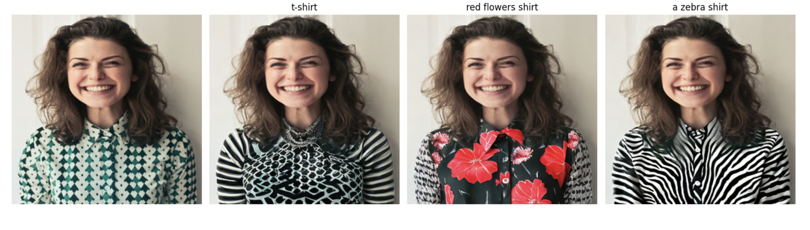

# Clothing Enhancement

Python, PyTorch, HuggingFace, SAM

Utilizing stable diffusion and image segmentation concepts, this project reimagines a person's clothing by repainting it, responding to given prompts or input.

sam_vit_h_4b8939.pth 
can be downloaded from "https://github.com/facebookresearch/segment-anything"

default or vit_h: ViT-H SAM model

